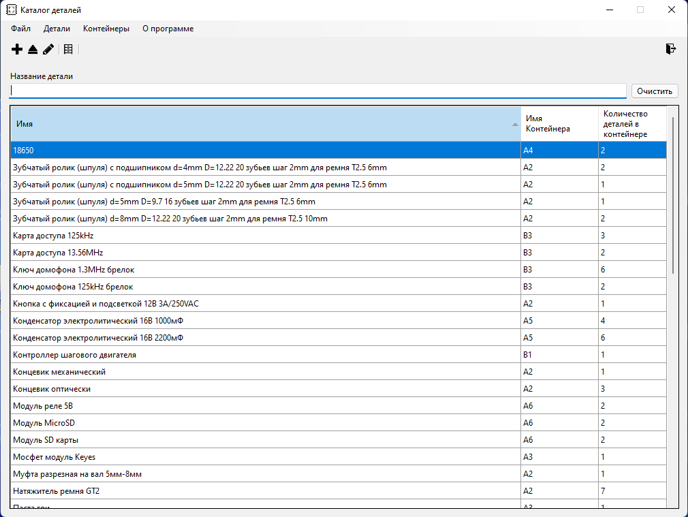

# RadioDB
## Что дает

Возможность создавать свой реестр деталей/предметов/чего угодно, размещенных в разных контейнерах (ящички, пакетики, что угодно).
Есть поддержка штрихкодов для добавления деталей и просмотра содержимого контейнера. Также есть поиск.
В данной реализации база хранится в файле рядом с исполняемым файлом - вы можете для себя в DBHelper классе имплементировать работу с любой базой данных.
## Дисклеймер
Это моя первая программа на C# - поэтому могут быть проблемы с архитектурой. Про переводы пока не думал, т.к. не разбирался как их делать по канону, потому только русский.